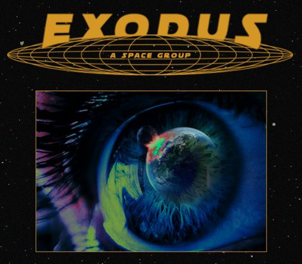

# 🧨🧠 Bacharelado em Matemática

[](https://github.com/bragaus/MATEMATICA-UNINTER)

> *"Não quero só aprender matemática... quero **codificar** o universo."*  
> — Eu, programando às 3 da manhã

Bem-vindo ao meu repositório de estudos, códigos, anotações e projetos enquanto curso o **Bacharelado em Matemática**, com um foco claro e afiado em **C++**, **engenharia de software**, **ciência espacial** e **modelagem computacional do universo**.

---

## 🌌 O Projeto: **Exodus**

<p align="center">
  
</p>

**Exodus** é uma *visão*: usar matemática e programação para entender, representar e navegar pelo espaço.

---

## 📂 Estrutura do Repositório

```text
MATEMATICA-UNINTER/
├── semestre1/                      
│   ├── fundamentos-da-matematica/         # Leis básicas do cosmos e suas expressões em C++
│   └── introducao-a-geometria-analitica/  # Eixos, vetores, curvas... o mapa para outras galáxias
├── semestre2/                       
│   └── ...                                # (o universo está em expansão)
├── canivete-matematico-cpp/               # Minha biblioteca pessoal de matemática em C++
│   ├── include/                           # Headers com fórmulas, constantes, structs
│   └── src/                               # Implementações, testes, algoritmos aplicados
└── README.md                              # Você está aqui (ou talvez já esteja em Alpha Centauri)
```
---
//===============================================  
//  CYBER-MATH ++ | [A MATRIX É VOCÊ]  
//  (c) 2025 - AGENTE [REDACTED]  
//  DISCLAIMER: Esse código atravessa dimensões
//===============================================

```text
while (vida) {
    estudar();
    codar();
    compilar_com_raiva();
}
```
C++でR言語を作る
